# 🏥 Healthcare Data Pipeline (Bronze -> Silver -> Gold)


An end-to-end data platform for health data: clinical trials, hospital claims, and synthetic EHR (FHIR) records. Built with **PySpark**, **Airflow**, **dbt**, and **DuckDB**.

---

## 🛠️ Tech Stack & Key Tools
| Domain | Tool | Usage |
| :--- | :--- | :--- |
| **Orchestration** | Apache Airflow | DAG-based ingestion and task management |
| **Processing** | PySpark (Spark 4.1.x) | Bronze-to-Silver transformations and deduplication |
| **Lakehouse** | Delta Lake (Parquet) | ACID-compliant storage for processed data |
| **Analytics** | dbt & DuckDB | Gold layer modeling and cross-domain analytics |
| **Testing** | Pytest & dbt-test | Unit testing logic and data quality checks |
| **CI/CD** | GitHub Actions | Automated pipeline testing on every push |

---

## 🏗️ Architecture Diagram


### Data Lifecycle
1.  **Bronze (Raw):** CMS Hospital Claims (CSV), ClinicalTrials.gov (JSON), and Synthea Patient Records (FHIR JSON).
2.  **Silver (Staging):** Standardized, deduplicated, and validated data stored as partitioned Delta Lake tables.
3.  **Gold (Analytics):** Unified patient-claims views and analytical cohorts created via dbt and DuckDB.

---

## 🚀 How to Run Locally
### 1. Environment Setup
```bash
# Clone and enter the project
git clone https://github.com/samil-web/healthcare-data-pipeline.git
cd healthcare_project

# Create a virtual environment
python3 -m venv venv
source venv/bin/activate
pip install -r requirements.txt
```

### 2. Ingestion & Transformation
```bash
# Profile the raw data
python3 data_profile.py

# Run the PySpark transformation (Bronze to Silver)
python3 spark_jobs/bronze_to_silver.py

# Run the dbt models (Staging to Gold)
cd dbt_healthcare
dbt run --profiles-dir .
```

### 3. Running Tests
```bash
pytest tests/
cd dbt_healthcare && dbt test --profiles-dir .
```

---

## ☁️ Production Strategy (Azure Databricks)
In a real-world enterprise environment, we would migrate this architecture to **Azure Databricks**:
-   **Catalog:** Use **Unity Catalog** for fine-grained access control on patient PII data.
-   **Compute:** Use **Serverless SQL Warehouses** for dbt models instead of local DuckDB.
-   **Ingestion:** Replace manual scripts with **Auto Loader** (cloudFiles) for real-time file discovery in ADLS Gen2.
-   **Orchestration:** Use **Databricks Workflows** or **Azure Data Factory** for tighter integration with cloud resources.

---

## 📝 Design Choices
See [DECISIONS.md](./DECISIONS.md) for a full breakdown of technical trade-offs made during development.
